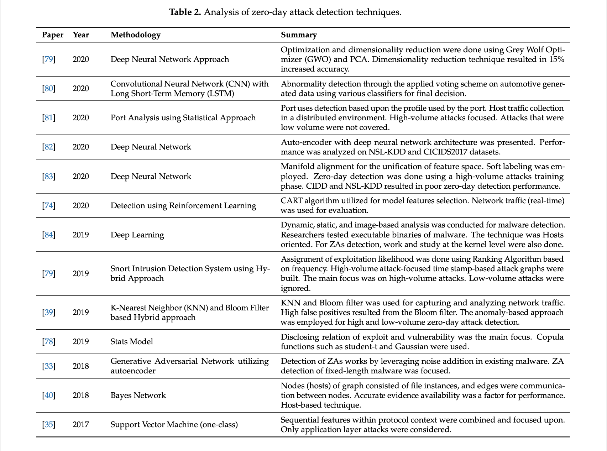

.. _conclusion.rst:

Conclusion
##########

Synthèse
========
Ce travail personnel, majoritairement théorique, a servi tout d'abord à :ref:`définir <definition.rst>` ce qu'était, à proprement parler, 
une faille informatique ainsi que les spécificités des vulnérabilités du type "zéro day". 
Nous avons aussi pu aborder les 7 étapes principales franchies lorsqu'apparaissent ces failles. 

Une fois les bases posées, nous avons pu montrer les enjeux énormes du :ref:`business <business.rst>` qui s'est développé autour de ce type de vulnérabilités.
Il a fallu aborder les méthodes honorables ainsi que les dispositifs mis en place pour les encourager, mais aussi les méthodes profondément malhonnêtes. 
Il nous est apparu qu'il existait une zone floue, un marché gris, entre ces deux types de méthodes, dont nous avons traité. 

Les éléments de nos définitions et les différents aspects amenés par le business créé par ces failles ont permis :ref:`l'analyse de certaines des plus connues d'entre elles <connues.rst>`.  
Ces failles connues ont été précédées d'un concept propre aux failles qui apparaissent sur Microsoft, le Patch Tuesday. 

Comme certains exemples soulevaient la :ref:`question de l'open source <opensource.rst>` et de sa disposition aux failles zéro day, 
le travail a débouché sur une partie exposant non seulement les principes de l'open source, mais encore tous les problèmes engendrés ceux-ci au niveau des vulnérabilités informatiques. 

Afin de donner du poids à nos exemples, mais aussi de prouver que les failles sont très courantes, nous avons proposé une :ref:`vidéo explicative <video.rst>`  d'exploitation d'une faille 
qui donne l'accès total à un ordinateur sous Windows 7.

Pour finir, après avoir démontré les immenses risques et la dangerosité de ces failles, il a été choisi, dans le but de rassurer quiconque lirait ce travail, de présenter 
quelques :ref:`conseils pour se protéger <protection.rst>` au maximum de l'exploitation d'une vulnérabilité zéro day.

L'IA, une solution ?
====================

Bien que l'intelligence artificielle puisse de nos jours être très néfaste pour la sécurité informatique, 
par exemple en générant du code fonctionnel malveillant :cite:p:`chatgpt:fonctionnel`, 
elle pourrait aussi se révéler salvatrice grâce à certaines de ses capacités dans un futur proche. 
En effet, bon nombre de techniques d'apprentissages des IA permettent de détecter les failles exploitées dans certains logiciels informatiques. 
Certaines IA ont obtenu des résultats juste phénoménaux. 
Pour illustrer ce propos, il est intéressant de savoir qu'une IA, basée sur l'apprentissage par renforcement notamment, a obtenu un taux de détection de 98,3%. 
De plus, cette IA a obtenu un taux de faux positifs assez remarquable de 0,012% :cite:p:`SD:botnet`. 
Il existe en réalité énormément de travaux de chercheurs qui ont utilisé soit le *Machine Learning* soit le *Deep Neural Network* pour leur détection d'exploits zéro day, autrement dit d'attaques exploitant des failles zéro day. 
Nous pouvons donc affirmer, qu'avec son développement grandissant, l'IA sera un atout majeur dans la lutte contre les attaques zéro day.
À titre indicatif, le tableau ci-dessous recense les analyses des différentes techniques de détection :cite:p:`electronics:zeroday`.

