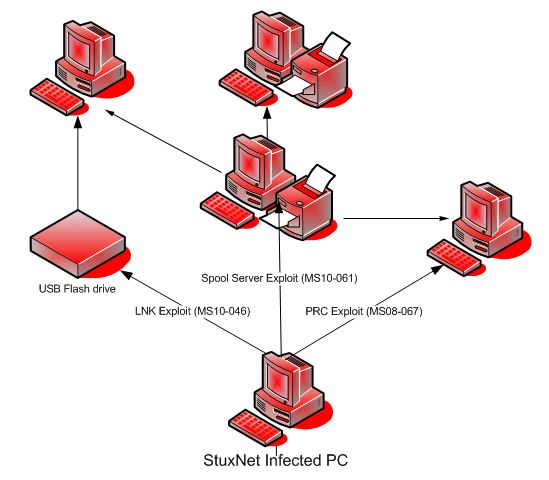
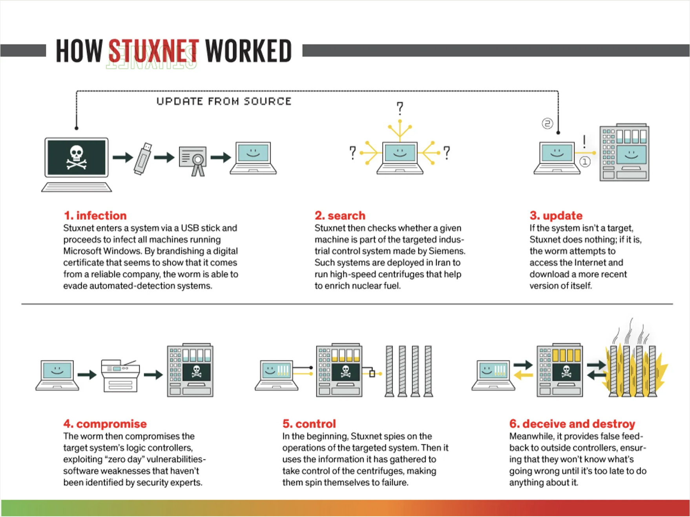
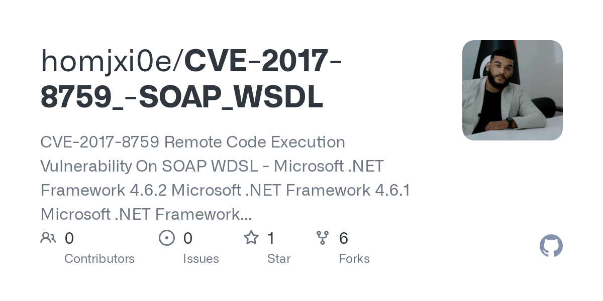
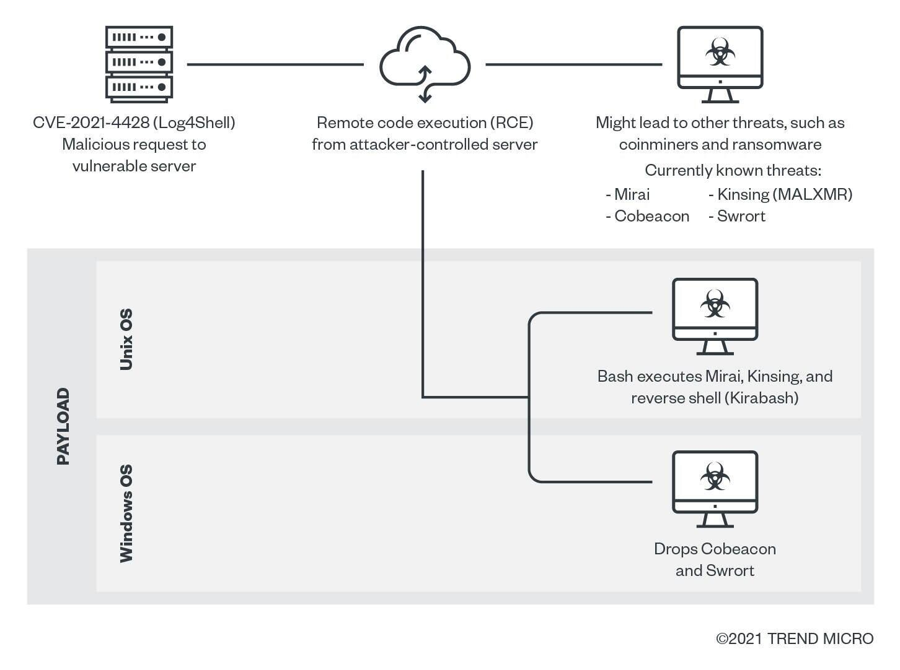
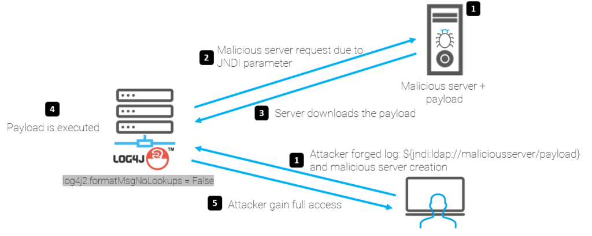

.. _connues.rst:
Les failles zéro day connues
############################
Dans cette partie nous allons détailler un certain nombre de failles zéro day qui ont fait l'actualité durant ces dernières années, en abordant le contexte de découverte ainsi que le contexte d'utilisation et leur impact sur le monde informatique.
Commençons, cependant, par aborder une habitude très intéressante et plus que connue de Microsoft qui est relative à ces
vulnérabilités.

Le Patch Tuesday
================
En effet, le jour où la société Microsoft met ses patchs de sécurité ainsi que ses logiciels
à jour pour ses clients, le jour où les correctifs des fameuses failles zéro day sont mis en place est devenu célèbre dans 
le monde entier.
Ce qui ne devait être qu'un deuxième mardi de chaque mois comme les autres est devenu le Patch Tuesday ou aussi appelé l'Update Tuesday.
Et cela dure depuis la publication du logiciel Windows 98 daté de l'année éponyme.
Ce qui est intéressant avec cette politique, ce sont les conséquences en matière de sûreté informatique.

C'est un parti pris dont l'atout principal est le fait d'être régulier, afin que les clients puissent suivre le rythme et se tenir relativement à jour, car c'est un rendez-vous attendu.
Toutefois, son rythme qui ne varie point peut aussi lui porter préjudice.
Effectivement, cette régularité presque immuable est lourde de conséquences et part du principe que le risque de faille zéro day dans le système n'est 
pas suffisamment élevé pour en tenir réellement compte.
Or, s'il s'avère qu'un cybercriminel trouve une faiblesse dans un logiciel de l'entreprise Microsoft et qu'il parvient à coder un malware exploitant la faille,
le temps d'exploitation de celle-ci, c'est à dire l'intervalle de temps durant lequel le hacker peut utiliser son exploit sans qu'aucun correctif ne soit mis en place, peut aller jusqu'à un mois.
C'est une durée considérable permettant, suivant la gravité de la vulnérabilité bien sûr, de causer énormément de tort et à l'entreprise et à ses clients.

Stuxnet
=======
Ce ver informatique, autrement dit un logiciel malveillant se duplicant à chaque exécution, a été découvert à la mi-juin 
2010 par VirusBlokada, une entreprise spécialisée dans la sécurité informatique :cite:p:`stuxnet:christmonitor`. 
Cependant, des traces de ce malware ont été retrouvées et dateraient de presque une année avant.
S'attaquant aux systèmes Windows, ce ver n'utilisait pas moins de 4 failles zéro day telles que "CPLINK" ou des failles comme celle utilisée par le ver Conficker.

De plus, celui-ci visait principalement les systèmes de l'entreprise Siemens qui est un grand groupe du secteur industriel 
et particulièrement les filiales iraniennes
puisque 30'000 des 45'000 infections ont eu lieu sur des systèmes en Iran :cite:p:`stuxnet:wash`.
Afin d'attaquer ces systèmes, ce ver informatique mettait à jour sur les appareils cibles un virus dejà existant et présent sur ceux-ci, 
puis en se servant de certains défauts innés dans la structure de ces systèmes, il contaminait bon nombre d'autres ordinateurs.
À l'intérieur du système, il employait les mots de passe par défaut fortement recommandés par Siemens afin de pouvoir faire des requêtes logicielles.
Celui-ci octroyait à l'attaquant le pouvoir de contrôler l'appareil et sa programmation.

**Illustrations du fonctionnement**

    
    Schéma de fonctionnement de Stuxnet :cite:p:`fig:figure41`

    Schéma de fonctionnement de Stuxnet :cite:p:`fig:figure42`

L'impact de ce malware a été considérable car la création d'un tel logiciel était tout bonnement inédite. 
Personne n'avait jamais découvert d'exploit aussi complexe et de surcroît exploitant 4 vulnérabilités zéro day à la fois :cite:p:`stuxnet:4vul`.
Un aussi grand nombre de failles totalement inconnues, non corrigées et exploitables a surpris le monde de la sécurité informatique.
Le développement de Stuxnet ne pouvait pas avoir été réalisé par le secteur privé car il était d'un niveau si élevé et le temps nécessaire à celui-ci était énorme. 
En effet, l'entreprise Microsoft l'a estimé à environ "10'000 jours hommes".

L'exploitation de ces failles a aussi eu un fort impact politique puisque, visant l'Iran, l'organisation américaine National Security Agency et l'unité israélienne 8200 ont été suspectées directement.
Les doutes se sont répandus et ont été de plus en plus forts alors que d'autres États tels que la Russie se mêlaient . 
Ainsi, au moment de son départ à la retraite, un général israélien du nom de Gabi Ashkenazi a avoué être un des responsables du ver Stuxnet ainsi que des attaques l'utilisant :cite:p:`stuxnet:general`.

Word et FinFisher
=================
C'est en 2017 que l'entreprise FireEye a découvert une faille zéro day dans le logiciel nommé Word créé par Microsoft en 1983.
Le nom de cette faille est CVE-2017-8759 et celle-ci a été utilisée dans de nombreuses attaques ciblées durant l'année 2017. 
Les attaques exploitant cette faille semblaient plutôt viser les russophones car le nom du fichier Word malveillant et infecté était en russe : "Проект.doc" :cite:p:`mandiant:wordfin`. 

Ce fichier, pour autant qu'il soit téléchargé puis ouvert sur un ordinateur, téléchargeait lui même du contenu sur l'appareil. 
Celui-ci se chargait notamment de charger un célèbre malware appelé FinFisher, FINSPY ou encore WingBird.
Cette action était possible, car CVE-2017-8759 est une vulnérabilité en relation avec une mauvaise validation dans une analyse 
du Web Services Description Language (WSDL) et permettait alors d'injecter du code arbitraire afin de l'exécuter par la suite. 

   Dépôt Github d'un exploit de CVE-2017-8759 :cite:p:`fig:figure43`

Cette faille, accompagnée du logiciel malveillant FinFisher, a donc permis à certains hackers de récupérer des informations de connexion pour les services bancaires ou d'accéder à d'autres données sensibles 
présentes sur les ordinateurs. 
Ce sont aussi des raisons qui font que les attaques ayant exploité cette faille ont été suspectées d'avoir été menées initialement par un État-Nation dans le but d'espionner une organisation russophone.

L'impact de cette faiblesse était notoire et dû à la diffusion phénoménale de celle-ci. 
En effet, cette faille se trouvait dans un des logiciels Microsoft les plus vendus au monde. 
Les documents Word étaient déjà répandus dans le monde entier par milliards à cette époque. C'est pourquoi, exploiter une faille présente dans ceux-ci pouvait non seulement toucher un nombre inimaginable de personnes 
mais aussi provoquer des dégâts conséquents en tous genres. 
La faille a été découverte en septembre. Or nous avons retrouvé des traces d'exploitations remontant jusqu'à juillet de la même année.
Ainsi, durant presque 3 mois, de nombreux crimes ont été commis par le biais de cette vulnérabilité.

Zoom 2020
=========
La compagnie de sécurité 0patch a remarqué aux alentours de juillet 2020 une faille de type zéro day dans le logiciel de vidéoconférence que certains ont connu grâce au confinement de cette même année, Zoom.
Cette faiblesse ne concernait que les utilisateurs sous Windows qui représentent, en fait, la grande majorité des clients de Zoom.
Une des fondatrices de l'entreprise ayant fait la découverte avait déclaré que cette vulnérabilité permettait l'exécution 
à distance d'un code arbitraire (Remote Control Execution) sans que l'utilisateur ne soit aucunement averti, car 
aucun message d'alerte ne s'affichait.

Les attaques ne pouvaient cependant être lancées que sur des appareils possédant un système d'exploitation Windows 7 ou 
une version antérieure. 
0patch a décrété, dès la découverte, que même les ordinateurs sous Windows 7 étant à jour au niveau de la sécurité pouvaient être victimes de ce type d'attaque 
puisque qu'aucun correctif n'était alors connu ou mis en place. Cela prouve que nous sommes vraiment dans le cas zéro day.
Aussi, les exploits pouvant être créé nécessitaient un de clicker sur un lien malveillant ou alors d'ouvrir un fichier frauduleux, ce qui a très légèrement réduit les chances de réussites des malwares exploitant la faille.
Nous n'avons à ce jour pas trouvé de traces d'exploitation de cette faille. 
Or, il a été confirmé qu'un malware développé exploitant cette faiblesse aurait permis à l'attaquant de prendre le contrôle total et à distance de l'ordinateur de la victime si elle était administratrice de celui-ci.

L'impact de cette vulnérabilité a été quelque peu différent, car il a été sourtout psychologique et ce pour deux raisons.
La première est que Zoom est une application relativement récente car elle a été commercialisée en 2012. 
Ainsi savoir qu'une application jeune, dynamique et qui devait être à la page au niveau sécurité était aussi vulnérable a été déroutant.
De plus, une application qui a connu un tel boom de téléchargement en 2020, puisque nous estimions l'augmentation des clients payants à 354% en juin 2020, se devait de garantir une certaine protection pour ses clients répartis dans le monde.
Un autre impact psychologique a été le sentiment de menace dans un contexte de tension. 
En effet, c'est en plein confinement dans une atmosphère plus que tendue à cause du COVID-19 que vient s'ajouter la menace d'une attaque dangereuse par 
le biais d'une application très utilisée. 

.. figure:: ./images/zoom.png
    :name: figure44
    :scale: 90%
    :align: center

    Capture d'écran d'une réunion zoom :cite:p:`fig:figure44`

Log4shell
=========
Décrite par Lunasec comme un échec dans la conception ayant des proportions catastrophiques :cite:p:`wired:internet_on_fire`, et aussi par Tenable comme 
la plus importante et critique des failles de la décennie :cite:p:`guardian:most_critical`, Log4shell ou CVE-2021-44228 a été découverte par une entreprise chinoise de sécurité informatique nommée Alibaba 
en fin d'année 2021. 
Cette vulnérabilité concernait la bibliothèque de Java appelé Log4j faisant partie d'un projet de la fondation Apache. 
Ce framework opensource sert à la journalisation d'un très grand nombre d'applications. 
Nous pensons notamment à certains logiciels de bureautique, aux systèmes embarqués de certaines voitures, à iCloud ou encore à Steam, la plateforme de jeux vidéos.

Cette faille était en relation avec les requêtes LDAP ou JNDI :cite:p:`pcmag:jndi, arstech:log4`. 
En effet, le logiciel ne prenait pas en compte ce type de requêtes concernant les annuaires. 
Par ce biais, l'attaquant pouvait injecter du code Java arbitraire sur un ordinateur ou un appareil qui établissait une connexion vers un serveur contrôlé par un tiers.
Il est assez évident que l'exécution de ce code pouvait se faire à distance, augmentant ainsi les risques d'infection. 
Alors, depuis n'importe où dans le monde, un hacker pouvait bénéficier d'un accès au système qui était complet.
Cette faille permettait plusieurs exploits tels que des Ransomware ou des DoS (Denial of Service) de réseau. 
Les cas d'exploitation ont été particulièrement nombreux et lourds de conséquences.
C'est aussi une des raisons pour lequelles l'Apache Software Foundation a attribué la note CVSS qui mesure la dangerosité ou criticité de la faille de 10, autrement dit la note maximale :cite:p:`apache:log4`.

**Illustrations du fonctionnement**

    Schéma du fonctionnement de log4shell :cite:p:`fig:figure45`

    Schéma du fonctionnement de log4shell :cite:p:`fig:figure46`

L'impact provoqué par cette faiblesse informatique a été gigantesque. Effectivement, les appareils vulnérables étaient répandus 
dans le monde entier à cause de l'immense popularité d'Apache, et se comptaient par centaines de millions.
Le caractère extrêmement critique de la faille ainsi que sa diffusion dans le monde ont même poussé certaines organisations nationales de cybersécurité à avertir les habitants 
et entreprises de leur pays ainsi qu'à
prendre certaines mesures. Citons la CISA (Cybersecurity and Infrastructure Security Agency) pour les USA, le NCSC (National Cyber Security Center) pour le Royaume-Uni, ainsi que 
le CCCS (Canadian Center for Cyber Security) pour le Canada. Ce dernier a conseillé aux organisations de prendre des mesures immédiates :cite:p:`canadian:log4`. 
À titre d'exemple, le gouvernement du Québec, par prévention, a fermé non loin de 4'000 sites Web. 
C'est ainsi que le monde entier a été invité à mettre à jour ses logiciels le plus rapidement possible 
lorsque le correctif a été mis en place le 6 décembre 2021.